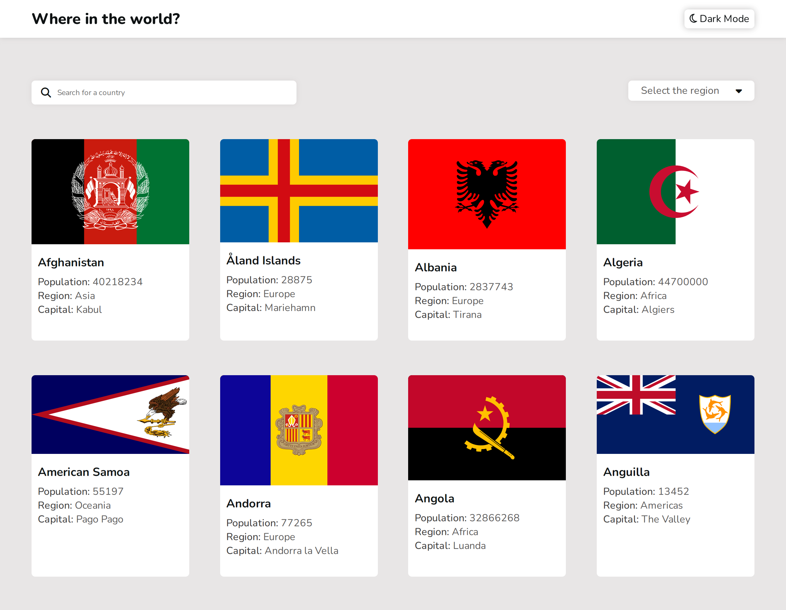

# Frontend Mentor - REST Countries API with color theme switcher solution

This is a solution to the [REST Countries API with color theme switcher challenge on Frontend Mentor](https://www.frontendmentor.io/challenges/rest-countries-api-with-color-theme-switcher-5cacc469fec04111f7b848ca). Frontend Mentor challenges help you improve your coding skills by building realistic projects. 

## Table of contents

- [Overview](#overview)
  - [The challenge](#the-challenge)
  - [Screenshot](#screenshot)
  - [Links](#links)
- [My process](#my-process)
  - [Built with](#built-with)
  - [What I learned](#what-i-learned)
  - [Continued development](#continued-development)
  - [Useful resources](#useful-resources)
- [Author](#author)
- [Acknowledgments](#acknowledgments)


## Overview
https://worldrestapi.netlify.app provides a comprehensive platform to search and explore information about various countries. It features:

Search Bar: Quickly find specific countries.

Region Dropdown: Filter countries by region.

Dark Mode Toggle: Switch between light and dark themes.

Responsive Design: Optimized for both desktop and mobile devices.

The site efficiently displays key details such as country names, flags, populations, regions, and capitals, ensuring a visually appealing and user-friendly experience.

### The challenge

Users should be able to:

- See all countries from the API on the homepage
- Search for a country using an `input` field
- Filter countries by region
- Click on a country to see more detailed information on a separate page
- Click through to the border countries on the detail page
- Toggle the color scheme between light and dark mode *(optional)*

### Screenshot




### Links

- Solution URL: [Add solution URL here](https://github.com/ShivWK/Country-Rest-API.git)
- Live Site URL: [Add live site URL here](https://worldrestapi.netlify.app/)

## My process

### Built with

- Semantic HTML5 markup
- CSS custom properties
- Flexbox
- Mobile-first workflow

### What I learned

## Project Learning Summary

### HTML:
I learned about the `tabindex` attribute, which allows non-focusable HTML elements like `div`, `p`, and `i` to receive focus. Although I encountered some issues and didn't implement it in this project, understanding its usage has expanded my knowledge.

```html
<p id="selectText" tabindex="0">Select the region</p>
<i id="icon" tabindex="1" class="fa-solid fa-caret-down"></i>
```

### CSS:
I created a responsive navigation bar. When set to `position: fixed`, it behaves like `position: absolute`, exiting the normal document flow. To manage its size, I set `width: 100%` and `max-width: inherit`, ensuring it stays within the container's width. I also applied a `z-index` to prevent background content from overlapping the navigation bar, especially when cards scale on hover.

```css
#header{
    display: flex;
    align-items: center;
    justify-content: space-between;
    height: 60px;
    background-color: white;
    padding: 2% 4%;
    width: 100%;
    max-width: inherit;
    margin-inline: auto;
    position: fixed;
    box-shadow: 0 0 10px rgb(194, 192, 192);
    top:0%;
    z-index:9999;
}
```

### JavaScript:
1. **Theme Consistency:**
   I implemented a consistent light/dark theme across the website using local storage. The selected theme (`light` or `dark`) is stored in local storage, and JavaScript checks this value on page load to apply the appropriate theme.

2. **Handling History Navigation:**
   I discovered that using the `history.back()` function restores the previous content without reloading the page, which means page load events don’t execute. To address this, I used the `pageshow` event, which triggers when the page is shown, even from the cache. This allowed me to reapply the current theme when the user navigates back to previous pages.

3. **Query Processing:**
   I explored and implemented query processing in JavaScript.

```js
document.addEventListener('DOMContentLoaded', ()=>{
    if(backbtn2){
        let modepresence = localStorage.getItem('mode')
        if(modepresence){
            applymode(modepresence);
        }
    }
})

<button id="backbtn" onclick="history.back()"><i id="icon" class="fa-solid fa-arrow-left"></i>&nbsp&nbspBack</button>

window.addEventListener('pageshow', () => {
    let modepresence = localStorage.getItem('mode');
    if (modepresence) {
        applymode(modepresence);
    }
});

const querystr = window.location.search;
const params = new URLSearchParams(querystr);
var countryname = params.get('countryName');

```

### Continued development

## Continued Development

### Mobile-First Design:
In future projects, I will adopt a mobile-first design approach to ensure optimal responsiveness. This means starting with styles for mobile devices and progressively enhancing the layout for larger screens.

### Blur Event on Custom Select List:
I encountered an issue when applying the blur event to a custom select list using the `tabindex` attribute. Although I succeeded in making the list open and close, clicking on the options no longer triggered the desired actions, such as filtering data. I will work on resolving this issue in future projects.

### Code Optimization:
For upcoming projects, I will focus on writing minimal, clean, and efficient code. This involves removing redundant code, improving code structure, and adhering to best practices for maintainable and scalable code.

### Lazy Loading with Intersection Observer API
In future projects, I plan to implement the Intersection Observer API to enable lazy loading of content. By loading elements like country cards only when they come into the viewport, I can reduce initial load times and save bandwidth. This approach will enhance efficiency, minimize resource usage, and provide a smoother, more responsive user experience.

### Useful resources
- [MDN Web Docs](https://developer.mozilla.org/en-US/) - A comprehensive resource for web developers with detailed documentation on HTML, CSS, and JavaScript. It provided clear explanations and examples that helped me understand and implement advanced features like responsive design and JavaScript event handling effectively.


## Author
- Shivendra Dwivedi
- Frontend Mentor - [@ShivWK](https://www.frontendmentor.io/profile/ShivWK)
- Twitter - [@Shivendrawk](https://www.twitter.com/Shivendrawk)


## Acknowledgments

I would like to acknowledge the following resources and communities that have supported and contributed to my learning journey during the development of this project:

MDN Web Docs: The comprehensive documentation on HTML, CSS, and JavaScript provided valuable insights and examples that greatly assisted in implementing advanced features.

Frontend Mentor: Completing challenges on Frontend Mentor significantly enhanced my frontend development skills by exposing me to industry best practices and real-world design implementations.

